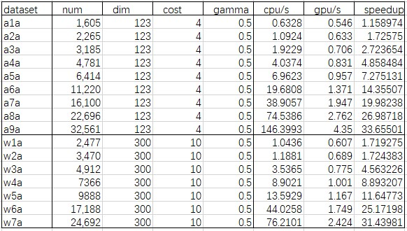

# Support-Vector-Machine

## Algorithm description

Support Vector Machine (SVM) is a binary classification model. Its basic model is a linear classifier with the largest spacing in feature space. It is essentially a non-linear classifier combined with kernel tricks. The essential mathematical problem is the optimal algorithm for solving convex quadratic programming. The original optimization problem is transformed into a dual problem by Lagrange duality, and then the training model is obtained by applying SMO algorithm.

## Usage

```cpp
// default run on CPU
result = svm(ref, label, query, c,g,svm_type,kernel_type);
// Use GPU speed up
result = svm(ref, label, query, c,g,svm_type,kernel_type).to(CUDA);
```

### Parameter

* `ref`：Features for training dataset，a tensor shape as `(ref_num, dim)`.
* `label`：Labels for training dataset，a tensor shape as `(ref_num, 1)`.
* `query`：Features for test dataset，a tensor shape as `(query_num, dim)`.
* `c`：Penalty param C.
* `g`：KernelMatrix param gamma.
* `svm_type`：0:C-SVC 1:SVR.
* `kernel_type`：0:LINEAR, 1:POLY, 2：RBF, 3：SIGMOID.


### Return

* `result`：Labels for test dataset，a tensor shape as `(query_num, 1)`.

## Performance

* Running time of CPU/GPU

  
