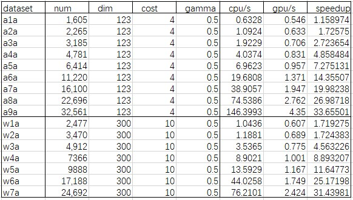

# Support-Vector-Machine

## 算法描述

支撑向量机是一种二分类模型，它的基本模型是定义在特征空间上的间隔最大的线性分类器，结合核技巧，实质上为一个非线性分类器。本质的数学问题为求解凸二次规划的最优化算法。将原始的最优化问题通过拉格朗日对偶性转化为对偶问题，再应用序列最小最优化算法SMO算法求解即可得训练模型。


## 语法说明

```cpp
// 默认CPU执行KNN
result = svm(ref, label, query, c,g,svm_type,kernel_type);
// 用CUDA加速执行KNN
result = svm(ref, label, query, c,g,svm_type,kernel_type).to(CUDA);
```


### 参数

* `ref`：训练数据特征，`(ref_num, dim)`的张量。
* `label`：训练数据类别标签，`(ref_num, 1)`的张量。
* `query`：测试数据集特征，`(query_num, dim)`的张量。
* `c`：惩罚参数C。
* `g`：核参数gamma。
* `svm_type`：0:多分类svc 1:回归svr。
* `kernel_type`：0:LINEAR, 1:POLY, 2：RBF, 3：SIGMOID,。

### 返回值

* `result`：测试数据类别标签，`(query_num, 1)`的张量


## 性能测试

* CPU/GPU运行时间

  
